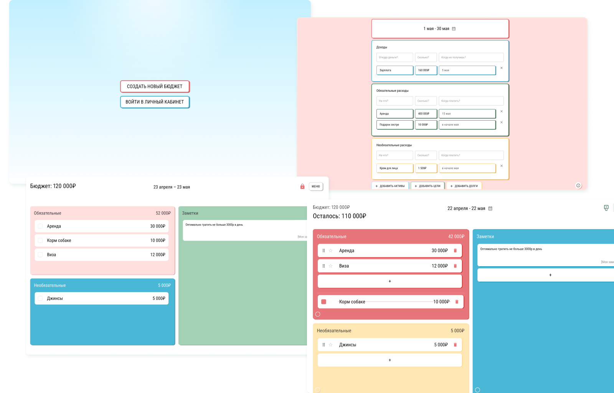

# Budget Planner

Budget Planner — веб-приложение для планирования личного бюджета с интерактивной рабочей доской.
Пользователь задаёт период, формирует структуру доходов и расходов и управляет бюджетом в визуальном интерфейсе: редактирует элементы, меняет приоритеты и отслеживает выполнение.



**Демо:** https://ai-budget.ru/

**Frontend (GitHub Pages):** https://larisa-vedenina.github.io/budget-planner/

> Публичная версия размещена на внешнем хостинге. Может потребоваться VPN.
>
> GitHub Pages-версия представляет собой статическое frontend-демо без серверной части.

---

## О проекте

Проект реализован мной полностью: от формулирования идеи и пользовательских сценариев до проектирования интерфейса и разработки клиентской и серверной частей.

Основной фокус — создание удобного инструмента для работы с бюджетом в формате “доски”, где важна не только фиксация данных, но и возможность гибко управлять ими в процессе планирования.

---

## Ключевые возможности

- создание бюджета с выбором периода и структуры доходов/расходов;
- интерактивная доска с возможностью:
  - редактирования элементов;
  - изменения приоритета;
  - drag-and-drop перестановки;
  - отметки выполнения;
- автосохранение изменений без явного подтверждения со стороны пользователя;
- undo / redo для работы с состоянием;
- настройка визуального представления (цвета секций);
- адаптивный интерфейс (desktop / mobile);
- архив бюджетов.

---

## Технические решения

- **Управление состоянием**
  - реализована логика undo/redo с историей изменений;
  - согласованность состояния при drag-and-drop и редактировании;

- **Интерактивность**
  - drag-and-drop без потери состояния и с корректным обновлением порядка элементов;
  - оптимизация перерисовок при работе с большим количеством элементов;

- **UX-подход**
  - автосохранение как основной сценарий работы;
  - возможность отката изменений;

- **Архитектура**
  - разделение клиентской и серверной логики;
  - подготовленная серверная основа для работы с пользовательскими данными и генерации стартового плана.

---

## Стек

**Frontend**
- React
- TypeScript
- SCSS Modules
- MUI

**Backend**
- Node.js

---

## Статус разработки

- реализована основная клиентская часть;
- подготовлена серверная инфраструктура;
- в процессе:
  - AI-генерация стартового бюджета;
  - SMS-верификация;
  - интеграция с базой данных.

---

## Локальный запуск

### Frontend

```bash
cd frontend
npm install
npm start
```

Приложение будет доступно по адресу: `http://localhost:3000`.

### Backend

```bash
cp backend/.env.example backend/.env
cd backend
npm install
npm start
```

Для серверных возможностей необходимо заполнить переменные окружения в `backend/.env` на основе `backend/.env.example`.
